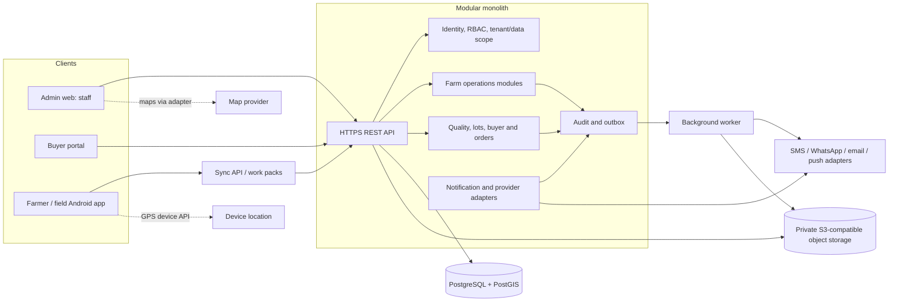
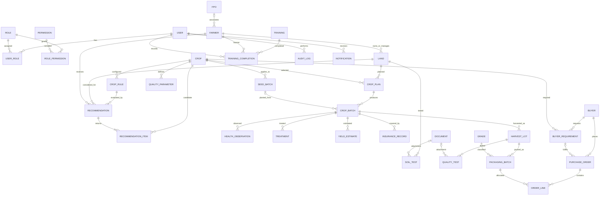

# Medicinal Crop Ecosystem — Phase 1 Discovery

**Status:** Draft for product and technical approval  
**Scope:** Discovery and design only; no application code or live agronomic rules are included.  
**Repository finding:** The supplied workspace was empty on 2026-09-24: no source files, Git repository, or existing product conventions were present.

## 1. Product architecture

Build one operational system around the traceable chain:

`Farmer → Land → Soil Test → Recommendation → Crop Plan → Crop Batch → Monitoring/Treatment → Harvest Lot → Quality Test → Package → Buyer/Order`

The system of record is a modular monolith with a versioned API and PostgreSQL. The admin web app, farmer mobile app, and buyer portal are separate clients. Business rules and authorization live on the server; clients do not independently decide suitability, lifecycle transitions, or data visibility.

Core boundaries:

- **Identity and access:** users, roles, permissions, sessions, assignments, and audit events.
- **Farm operations:** farmers, FPOs, land, soil tests, crop catalog, configurable crop rules, plans, seed lots, crop batches, field observations, treatments, and yield estimates.
- **Post-harvest and commerce:** harvest lots, quality tests, grades, packages, buyers, requirements, purchase orders, and fulfillment records.
- **Operations support:** training content/completions, documents, notifications, dashboard queries, and exports.

Every operational record has a UUID primary key, timestamps, provenance (creator/source where applicable), and foreign keys to its parent records. Human-readable IDs such as `FARMER-JH-00001` are unique display identifiers, not database keys. Use soft deletion for master/profile records where recovery or audit is needed; use explicit cancellation/voiding for business events so history is retained.

## 2. User journeys

### Farmer onboarding and crop start

1. Coordinator creates a farmer profile, chooses language, records consent and only necessary documents, and assigns a stable Farmer ID.
2. Coordinator records one or more land parcels, approximate GPS point and stated area. Boundary polygon is optional and only recorded if actually captured; never infer one from a point.
3. Coordinator records irrigation, water availability, soil type, previous crop, and land tenure fields that the business decides to collect.
4. Soil sample is sent to a selected lab; an authorized user enters results and attaches the report. Older tests remain available.
5. Agronomist reviews rule-based crop options, with agronomic fit separated from buyer demand. The user sees score, contributing factors, missing inputs, rule-set version, caveats, and the reviewer.
6. Farmer/coordinator selects a candidate. An agronomist approves the plan; planting date and input allocation are recorded; a crop batch is created at planting.

### Field operations and harvest

1. Farmer sees localized tasks and crop-specific training cards; completion can be recorded offline.
2. Coordinator records dated observations, photos, GPS when available, and follow-up tasks against a crop batch.
3. Authorized agronomist records treatment advice and outcome. Advice includes who recommended it and any required review; recommendations are not presented as guaranteed or universally authoritative.
4. Coordinator records a range-based yield estimate and method. Readiness remains an explicitly reviewed status, not an automatic promise.
5. Harvest creates one or more harvest lots with actual quantity, unit, moisture and handling information.
6. Quality staff records sample, configurable tests, results, grade, and report. Failed or pending tests are not shown as quality-passed supply.
7. Packaging staff creates package batches linked to their harvest lots and applies a controlled QR identifier.

### Buyer sourcing and sale

1. Staff records buyer organization, contacts, crop/quality requirements, target quantity and delivery date.
2. Staff sees eligible packages/lots and records allocation against an open requirement or purchase order.
3. Buyer portal shows only explicitly published lots: crop, available quantity, grade, harvest date, quality/test status, coarse location, and traceability summary.
4. Purchase order and fulfillment records link buyer, requirement, package/lot, quantities and status. Farmer identity, phone, exact coordinates, and documents stay private unless a separate authorization and business basis is established.

### Offline field work

1. An authenticated coordinator downloads an assigned, bounded work pack while online.
2. The mobile app stores assigned farmer/land/crop reference data and tasks locally; it queues observations, photos, and permitted edits with client-generated UUIDs and timestamps.
3. Sync submits idempotent operations. Server validates current permissions and entity versions, accepts independent records, and returns per-item accepted/conflict/rejected results.
4. Conflicting edits to the same authoritative field are shown for review; the client never silently overwrites server data. Photos retry separately and display upload state.

## 3. System architecture



Deployment starts as a small number of containers: web client, API, worker/scheduler, PostgreSQL, and an S3-compatible object store (managed service in production). A reverse proxy/load balancer terminates TLS. The worker handles notifications, report processing, and retryable object operations. Keep modules in one deployable backend and one database; use module boundaries and transactional outbox records so later extraction is possible only if operational evidence requires it.

## 4. Component architecture and technology recommendation

| Area | Recommendation | Reason / boundary |
|---|---|---|
| Staff web | React + TypeScript, using a maintained web framework (Next.js is the default candidate) | Forms, tables, dashboards, and bilingual interface; API remains the source of business rules. Confirm hosting/team familiarity before choosing framework-specific features. |
| Buyer portal | Same web codebase, separate route group and authorization policy | Keeps initial operations lean while allowing separate branding and public/private layouts. |
| Mobile | Flutter, Android-first | One codebase for Android and possible later iOS; local persistence, camera, GPS, and background/foreground sync adapters behind repositories. Validate target device range and offline behavior on actual field devices. |
| API | Python + FastAPI, Pydantic schemas, SQLAlchemy 2, Alembic migrations | Typed HTTP API, input validation, migration workflow, and generated OpenAPI. Keep business logic in domain/service modules rather than route handlers. |
| Database | PostgreSQL with PostGIS | Relational integrity for lifecycle records; optional point/polygon geodata and spatial indexes. Coordinate storage can begin with optional points; no boundaries required. |
| Files | Private S3-compatible object storage, with metadata in PostgreSQL | Reports and images are not stored as public blobs. Access via short-lived authorized URLs; malware/content checks and size/type restrictions at upload. |
| Auth | OIDC-compatible identity provider if available; otherwise a vetted provider-backed implementation | Avoid custom password/session cryptography. Short-lived access, refresh/session revocation, MFA for privileged roles, and server-side authorization. Provider selection is an open decision. |
| API contract | REST under `/api/v1`, OpenAPI generated from API schemas | Browser/mobile interoperability and auditable client contracts. Use stable error envelopes, pagination, idempotency keys on sync/event creation. |
| Delivery | Docker images; managed cloud database/object storage; GitHub Actions or equivalent | Reproducible environments, migration gates, deployment approval, backups, and basic observability without Kubernetes at pilot scale. |

Two alternatives considered:

1. **Django + Django REST Framework:** strong integrated admin and ORM; a good choice if the team values built-in CRUD administration. The system still needs a purpose-built admin UI and careful domain boundaries, so FastAPI is preferred for an explicit API-first web/mobile product.
2. **React Native instead of Flutter:** reasonable if the delivery team already has deep React/TypeScript experience. Flutter is preferred provisionally for consistent UI and local-first field workflows; team experience and required native device integrations should decide before Sprint 1.

Use Flutter's repository/data-source pattern to combine local and remote data, and treat offline scope as feature-specific rather than assuming every operation is offline-safe. FastAPI documents OpenAPI/JSON Schema generation; PostgreSQL constraints and indexes should enforce relational invariants. Sources: [Flutter offline-first guidance](https://docs.flutter.dev/app-architecture/design-patterns/offline-first), [Flutter architecture](https://docs.flutter.dev/app-architecture), [FastAPI features and OpenAPI](https://fastapi.tiangolo.com/features/), [PostgreSQL constraints](https://www.postgresql.org/docs/16/ddl-constraints.html).

## 5. Database ER diagram

UUIDs are primary keys unless noted; `public_id` is a unique, non-secret operational identifier. `created_at`, `updated_at`, and where relevant `created_by`/`updated_by` are standard columns. M:N links are explicit join entities.



`RECOMMENDATION` is an immutable evaluation header (input snapshot, evaluator and rule-set version); `RECOMMENDATION_ITEM` stores each candidate's score, reasons, agronomic result, commercial signal, caveats, and missing input flags. Store rule revisions and activation dates so historical recommendations can be reproduced. Soil result units and crop quality parameters require explicit unit/reference metadata; do not treat missing measurements as zero.

## 6. Entity list and principal constraints

| Entity | Key relationships and important fields / constraints |
|---|---|
| User, Role, Permission, UserRole, RolePermission | Unique normalized login; role assignments may be scoped to FPO/region where needed. Do not treat role alone as row-level authorization. |
| Farmer | Unique `public_id`; language, contact, address, status, consent timestamps, optional FPO FK; avoid storing identity numbers unless approved need and retention rules exist. |
| FPO | Organization profile and status; optional membership history if farmers may change associations. |
| Land | Farmer FK; unique public ID; area as positive decimal + unit; optional PostGIS point/polygon; irrigation, water, tenure, previous crop, status. Coordinates and polygon must be nullable. |
| SoilTest | Land FK; test/sample date, lab, measured numeric values, units/method where available, texture/drainage/moisture, remarks, report document FK; index `(land_id, tested_at DESC)`. Multiple historical tests allowed. |
| Crop | Stable code, scientific name, common names/localizations, description, duration, planting/harvest windows, instructions, risks; active/version status. Crop values are curated data, not source-code constants. |
| CropRule | Crop FK, version, input condition/config JSON with schema version, score/reason configuration, effective dates, status, reviewer and evidence reference; immutable after activation. |
| Recommendation, RecommendationItem | Input snapshot, missing fields, rule set, separate agronomic and commercial outputs, human review status; preserve generated result. Never assert guaranteed yield/profit. |
| CropPlan | Farmer, land, crop, optional variety, planned area, planting/expected dates, yield range, inputs/plans, target buyer, lifecycle status/version; area cannot exceed recorded land area without override/reason. |
| SeedBatch | Crop/variety, supplier/source, batch, received date, quantity/unit, certificate document and quality status; unique supplier/batch combination where supplier exists. |
| CropBatch | CropPlan FK, seed batch optional FK, unique QR token/public code, actual planted area/date, lifecycle status; maintain same farmer/land/crop context as parent plan. |
| Training, TrainingCompletion | Training category, crop applicability, language/version/content references; completion unique per learner/content version as appropriate. |
| HealthObservation | CropBatch FK, observed time, stage, symptom/status fields, location optional, remarks, author, sync metadata; photo/document links; indexed by batch and time. |
| Treatment | CropBatch FK, problem, diagnosis source, recommended action/input/quantity/method, recommender, application and follow-up dates, result; capture advice versus actually applied treatment distinctly. |
| YieldEstimate | CropBatch FK, min/expected/max quantity with unit, estimate date/stage/method, author and field-observation references; enforce nonnegative and `min ≤ expected ≤ max`. |
| InsuranceRecord | CropBatch/Farmer/Land/Crop references; provider as data, policy/coverage dates and amounts, status, claim refs/status; no insurer-specific workflow dependency. Access restricted. |
| HarvestLot | CropBatch FK, public ID, date, actual quantity/unit, moisture, methods, storage, initial observations; one-to-many from crop batch. |
| QualityParameter | Crop FK, parameter code, unit, method and crop-specific acceptable range/spec version; governed and versioned. |
| QualityTest | HarvestLot FK, lab, sample, date, parameter results (normalized child rows), pass/fail/pending, report document, grade, remarks; preserve retests and evaluator. |
| Grade | Versioned crop-specific grade definition and criteria reference; do not assume a universal grading scale. |
| PackagingBatch | HarvestLot FK, unique package ID/QR token, batch number, net weight/unit, date/type/storage/status/grade; package totals cannot exceed source lot quantity without recorded adjustment. |
| Buyer | Organization/contact/location/type/status; buyer private data not visible to other buyers. |
| BuyerRequirement | Buyer and crop FKs, quantity/unit, spec version, delivery date, open/fulfilled status; commercial interest does not alter agronomic score. |
| PurchaseOrder, OrderLine | Buyer, optional requirement, statuses, dates and agreed terms; lines allocate package/lot quantity with checks against available quantity; record cancellation/fulfillment history. |
| Document | Private object key, MIME/size/checksum, owner/reference, uploader, scan state, visibility classification, retention/deletion metadata; object key never public. |
| Notification | Recipient, channel, template/language, event reference, delivery state/provider ID/retries; store minimum necessary payload. |
| AuditLog | Actor, action, entity type/id, time, request/correlation ID, old/new change set with sensitive values redacted; append-only permissions and retention policy. |
| OutboxEvent / SyncOperation | Transactional event delivery and mobile idempotency: operation UUID, actor/device, entity, client base version, payload/schema version, status/result. |

Use FK constraints, `CHECK` constraints for row-local numeric/status rules, unique constraints for IDs and relationship keys, and indexes for common filters/joins. Add GiST indexes to spatial columns if spatial lookup is needed. Avoid giant JSON documents for primary business data; JSON is suitable for versioned rule inputs, extensible lab parameter values with schema/version, and audit change details when normalized query needs are limited.

## 7. Lifecycle state models

### Crop plan / crop batch

Keep plan approval separate from observed crop lifecycle. Suggested plan states:

`DRAFT → SUBMITTED → APPROVED → PLANNED → CANCELLED`

Planting creates a batch with states:

`PLANNED → PLANTED → GROWING → HARVEST_READY → PARTIALLY_HARVESTED → HARVESTED → CLOSED`

Allow `CANCELLED` only before planting; allow `ABANDONED` with reason from active stages. A transition service checks allowed edges, role, required fields, and records a domain event/audit row. Harvest readiness requires an authorized review and does not guarantee quantity or sale.

### Insurance, quality, packaging, buyer

- Insurance: `NOT_OFFERED`, `OFFERED`, `APPLICATION_STARTED`, `ACTIVE`, `CLAIM`, `CLOSED` as requested; external provider events are recorded, not simulated as insurer decisions.
- Quality: `PENDING`, `IN_PROGRESS`, `PASS`, `FAIL`, `RETEST_REQUIRED`; publish eligibility requires the configured business rule, normally a passing applicable quality test.
- Package availability: `DRAFT`, `AVAILABLE`, `RESERVED`, `PARTIALLY_SOLD`, `SOLD`, `ON_HOLD`, `CANCELLED`.
- Buyer requirement: `DRAFT`, `OPEN`, `PARTIALLY_FULFILLED`, `FULFILLED`, `CANCELLED`, `EXPIRED`.
- Purchase order: `DRAFT`, `CONFIRMED`, `PARTIALLY_FULFILLED`, `FULFILLED`, `CANCELLED`; exact commercial/legal terms are a business decision.

## 8. API module list and contract outline

All routes use `/api/v1`, JSON schemas, authentication except explicitly published buyer data and login/health routes, cursor or bounded page pagination, server-side authorization, and consistent errors (`code`, `message`, `field_errors`, `request_id`). Mutations accept an idempotency key where clients may retry. Resource IDs in URLs are UUIDs; operational IDs are response fields. State changes use explicit action routes and concurrency versions, not arbitrary status assignment.

| Module | Initial route outline |
|---|---|
| `/auth` | `POST /sessions`, `DELETE /sessions/current`, `POST /sessions/refresh` (if provider model supports it), `GET /me`; OIDC callbacks handled by configured identity provider. |
| `/users`, `/roles` | Staff user administration, role assignment and permission catalog; privileged and audited. |
| `/farmers` | `GET/POST /farmers`, `GET/PATCH /farmers/{id}`, status and FPO assignment actions. |
| `/lands` | `GET/POST /lands`, `GET/PATCH /lands/{id}`, optional `POST /lands/{id}/boundary`; authorized GPS capture metadata. |
| `/soil-tests` | `GET/POST /soil-tests`, `GET/PATCH /soil-tests/{id}`, attach report through `/documents`; history filtered by land. |
| `/crops`, `/crop-rules` | Crop catalog read/write, versions and rule validation/approval/activation endpoints; no client edits to active rules. |
| `/recommendations` | `POST /recommendations/evaluate`; `GET /recommendations/{id}`; `POST /recommendations/{id}/review`; persist snapshot and rule version. |
| `/crop-plans` | `GET/POST /crop-plans`, `GET/PATCH`, `POST /{id}/submit`, `/approve`, `/plan`, `/cancel`. |
| `/seed-batches` | CRUD/list, receive/quality status, allocation lookup; certificate via document service. |
| `/crop-batches` | Create at planting, list/detail, authorized lifecycle action, controlled QR public payload endpoint with opaque token. |
| `/training` | List/filter content, content CRUD for staff, `POST /{id}/completions`, completion history. |
| `/monitoring` | `GET/POST /crop-batches/{id}/observations`, observation detail/edit with version check, photo attachments. |
| `/treatments` | Create/list/update result/follow-up against crop batch; recommendations attributed to staff. |
| `/yield-estimates` | `GET/POST /crop-batches/{id}/yield-estimates`; range and method validation. |
| `/insurance` | Restricted record create/list/update/status event; provider adapter callback interface remains provider-specific and deferred. |
| `/harvest` | Create/list harvest lots by crop batch, detail/adjustment action with reason. |
| `/quality` | Create quality test, append parameter results, attach report, authorized result/grade review. |
| `/packaging` | Create package batches, list available, reserve/release, update status; allocation guarded transactionally. |
| `/buyers`, `/buyer-requirements` | Buyer and requirement CRUD, status actions and match suggestions for staff. |
| `/purchase-orders` | Create, confirm, cancel and fulfill order; order lines allocate package quantity with concurrency control. |
| `/dashboard` | Role-scoped summary counters and bounded time series; aggregate endpoints, no unrestricted data dump. |
| `/notifications` | Preference, inbox/read state, staff send where authorized; provider delivery is asynchronous. |
| `/documents` | Initiate upload, complete upload, metadata/download authorization, quarantine/review state. Never return permanent public URLs. |
| `/sync` | `GET /work-packs`, `POST /operations`, `GET /operations/{id}`, `POST /pull` using cursor and per-item outcomes. |
| `/audit`, `/exports` | Restricted search/export with filters, purpose, audit, and bounded asynchronous jobs. |

The generated OpenAPI contract is checked into or published from the backend build; clients consume typed generated API models where useful. API implementation and schema are Sprint 0 design artifacts; detailed request/response examples should be completed before each sprint endpoint is built.

## 9. RBAC model

Use named roles mapped to permissions; enforce permissions plus record scope (assigned farmer/FPO/region and purpose) on the server for every read and write. Deny by default. Role names are seed data and new roles can be added without code branches. A user can hold multiple roles. Buyer accounts are scoped to their buyer organization. Staff access to farmer contact, exact location, KYC references, and insurance data is separately permissioned and audited.

| Capability | Super Admin | Admin | Agronomist | Field Coordinator | Quality Manager | Buyer | Farmer |
|---|---:|---:|---:|---:|---:|---:|---:|
| Manage users, global roles/config | Yes | Scoped | No | No | No | No | No |
| Farmer profile / land operations | Yes | Yes | Read assigned | Create/update assigned | Limited read | No | Own read / approved edits |
| Soil tests / crop rules | Yes | Yes | Create/review/activate rules | Capture assigned tests | No | No | Own read |
| Recommendations / plan approval | Yes | Yes | Review/approve | Draft/capture | No | No | Own view/acceptance |
| Field observations / treatments | Yes | Yes | Review/recommend | Record assigned | Read | No | Own tasks/observations |
| Insurance records | Restricted | Restricted | Limited assigned | Capture offer/status only | No | No | Own summary |
| Harvest / quality / packages | Yes | Yes | Read | Capture harvest | Create/review quality and grade; packaging as delegated | Published lots only | Own batch/lot summary |
| Buyers / requirements / orders | Yes | Yes | Read | No | Read relevant lots | Own profile/requirements/orders | Own sale information as approved |
| Audit/export | Yes | Yes, scoped | No | No | Quality scope | Own order records | Own data export request |

Grant `SUPER_ADMIN` sparingly, require MFA for privileged staff, and log role changes. Farmers and buyers may not update authoritative agronomic, test, grade, or sale status records directly.

## 10. Repository structure

```text
.
├── backend/
│   ├── app/
│   │   ├── api/v1/          # routers and HTTP schemas
│   │   ├── core/            # settings, auth, errors, logging
│   │   ├── modules/         # identity, farmers, land, soil, crops, field, quality, trade...
│   │   ├── db/              # session, models, migrations support
│   │   ├── services/        # storage, notifications, maps, audit/outbox
│   │   └── main.py
│   ├── migrations/
│   └── pyproject.toml
├── frontend/                # React/TypeScript staff and buyer web clients
├── mobile/                  # Flutter farmer/field app and local DB/sync
├── docs/                    # approved product, architecture, API, data, security, runbooks
├── infrastructure/          # Docker, deployment templates, observability config
├── scripts/                 # data import/export and operational scripts
├── tests/                   # contract, integration, end-to-end and test fixtures
├── .env.example             # names and safe local defaults only
├── compose.yaml             # local development services
└── README.md
```

Keep migrations and module ownership clear. Do not commit credentials or real farmer data. Environment-specific configuration is injected at runtime.

## 11. Deployment architecture

For a 25-farmer pilot, use one region and one production environment with separate development/staging environments. Deploy stateless API and worker containers; managed PostgreSQL with automated encrypted backups and tested restore procedure; private object storage with lifecycle rules; TLS ingress; managed secrets; central logs, metrics, error reporting, and alerts. Start with one API replica and one worker, then scale horizontally as measured need arises. Avoid Kubernetes until deployment/availability needs justify its operational cost.

Release flow: pull request checks → build immutable image → deploy staging → migration compatibility check → approval → production rolling deployment → smoke verification/rollback path. Migrations are backward-compatible across a rollout where possible; destructive column removal is a later migration. Keep staging data synthetic. Define recovery objectives, backup retention, and incident owner before onboarding real farmer data.

## 12. Security and privacy architecture

- **Authentication:** use a maintained OIDC/session provider; TLS everywhere; short-lived credentials, revocation, rate-limited login and MFA for privileged staff. Avoid custom auth protocol implementation.
- **Authorization:** centralized permission checks plus row scoping; farmer owns farmer-visible records, buyer scopes to own organization, staff assignments constrain field access. Apply checks in backend services, not just UI navigation.
- **Data minimization:** collect alternate contact, tenure, documents, and precise coordinates only when a documented workflow needs them. Make polygons optional. Define consent and purpose text before collection.
- **Location and QR:** public QR uses random opaque token, revocable/rotatable, and returns crop/lot/quality facts only. Never expose farmer name, phone, exact coordinates, or document links; buyer staff view gets only an approved coarse location.
- **Files:** private buckets, allowlisted types and size limits, generated object names, malware scanning/quarantine, authorization at every download, expiring signed URLs, metadata/audit, retention and deletion process.
- **Integrity:** request validation, CSRF controls for cookie sessions, CORS allowlist, rate limits, parameterized queries, output encoding, security headers, secret manager, dependency/image scanning, and least-privilege service/database accounts.
- **Audit:** append-only application audit with before/after values, actor and reason for sensitive corrections. Redact credentials, tokens, identity numbers, and unnecessary personal fields.
- **Operations:** encrypted storage/backups, restore drills, monitoring for auth failures and export/download spikes, incident response and access review. Set retention and deletion schedules with counsel and operating partners before production.
- **Agronomic safety:** rule configurations require qualified reviewer, source/evidence, version, effective date and approval. Missing inputs lower confidence or block recommendation; content distinguishes recommendation from guarantee. Treatment advice provenance and follow-up are mandatory.

This document is a technical design, not a legal determination. Indian privacy, consent, retention, telecommunications messaging, insurance distribution, food/drug/quality, and electronic transaction obligations need qualified local review before those workflows launch.

## 13. Offline synchronization strategy

Offline support is limited to assigned field work and is not a second system of record. The app uses a local encrypted database and an outbox queue. Initial offline read set: current user's profile summary, assigned farmer/land/crop details, active plans, task/training cards, crop reference data, and recent observations. Offline writes: observations, task completions, GPS capture, and locally captured photos; edits to identity, rule configuration, approvals, inventory allocation, insurance policy status, and purchase/quality decisions require online authorization.

Each operation carries a client UUID, device/install ID, schema version, actor, entity ID, base server version, client timestamp, and payload. Server receipt time is authoritative for audit. Retries are idempotent; per-operation responses expose accepted, duplicate, conflict, or validation/authorization rejection. Append-only observations can be accepted independently; concurrent edits to the same field use version checks and conflict resolution UI. Device clocks are advisory. Use paged pull cursors, tombstones for deleted/inaccessible cache entries, bounded work packs, resumable photo upload, visible last-sync/error status, and logout cache wipe. Protect local files/database with platform secure storage and OS encryption where available. Define offline expiration/re-auth behavior and lost-device response before field rollout.

## 14. Phase 1 roadmap and sprint breakdown

The requested sequence is retained, with the pilot workflow receiving priority and buyer portal/operational hardening included before broad expansion.

| Sprint | Outcome / included modules | Exit evidence |
|---|---|---|
| 0 — Discovery | PRD, journeys, architecture, ER/API/security/deployment design, assumptions and approvals | Product and technical owners approve scope, open decisions are resolved or explicitly deferred. |
| 1 — Identity + farm base | Auth, RBAC, audit foundation, Farmer/FPO, Land, Soil Test, private documents | Staff can onboard farmer/land, attach and retrieve authorized soil report, view history. |
| 2 — Plan | Crop catalog, versioned configurable rules, recommendation record/review, crop plan | Reproducible rule-based recommendation with explanation and human-reviewed plan. |
| 3 — Plant | Seed batch, planting allocation, crop batch/QR, training content and completion | Planted batch links to land/plan/seed lot; controlled QR reveals approved details. |
| 4 — Field operations | Task list, monitoring, photos, treatment, field visits, notification abstraction | Staff records observations/treatments; farmer sees assigned localized tasks. |
| 5 — Production | Yield estimates, harvest lots, quality tests, grade and packaging | Lot/package traceable to crop batch with quality-controlled availability. |
| 6 — Demand | Buyer records, requirements, buyer portal, package availability, basic purchase order and fulfillment | Buyer sees only published lots; requirement/order allocations cannot oversell. |
| 7 — Operations | Role-scoped dashboards, reports/exports, audit search, pilot data quality tools | KPI definitions reconcile to source records; exports are authorized and audited. |
| 8 — Field readiness | Offline sync, performance, security review, accessibility/localization, deployment/backup/recovery | Representative device/offline pilot and operational readiness sign-off. |

Mobile offline foundations should be prototyped early in Sprint 1/2, but broad sync scope ships in Sprint 8 after data ownership and conflict rules are agreed. Do not defer validation of low-connectivity devices until the final sprint.

## 15. Complexity estimate by module

Relative estimates for a small experienced cross-functional team; XS (1–2 person-weeks), S (2–4), M (4–7), L (7–12), XL (12+). These exclude external approvals, provider onboarding, production data cleanup and unknown device constraints; estimates must be recalibrated after decision answers and a device/site review.

| Module | Estimate | Main complexity driver |
|---|---:|---|
| Discovery, workflows, UX language/content | M | Agreeing operational ownership, consent and agronomy review process. |
| Auth, RBAC, audit | L | Row-level staff scope, buyer/farmer isolation, privacy/audit completeness. |
| Farmer, FPO, land, GPS | M | Data quality, duplicate detection, optional geometry and assignment model. |
| Soil tests, documents | M | Lab variants, units, attachments, authorization and history. |
| Crop catalog/rules/recommendations | L | Rule configurability, versioning, missing-data behavior, expert validation. |
| Plans, state machine, seed/crop batches, QR | M | Cross-entity invariants, allocation, secure public traceability. |
| Training and localization | M | Hindi content production, low-literacy UX, media delivery. |
| Monitoring, photos, treatment, tasks | L | Field usability, treatment provenance, offline capture. |
| Yield, harvest, quality, grade, packaging | L | Units, retesting, quality specs, quantity reconciliation and traceability. |
| Buyer requirements, portal, procurement | L | Public/private visibility, demand matching and inventory allocation. |
| Dashboard, export, reporting | M | KPI definitions, scoped aggregation, privacy and data reconciliation. |
| Offline sync and mobile hardening | XL | Conflict handling, media retry, device storage, network variability. |
| Notifications and integrations | M | Provider approvals, delivery/retry semantics, consent and template operations. |
| Deployment, observability, security hardening | M | Cloud choice, backups, monitoring, operational ownership. |

## 16. Risks and assumptions

| Risk / assumption | Response |
|---|---|
| Agronomic ranges or treatment advice are not yet validated | Ship no active production rules until qualified experts approve source, units, locality and version. Seed catalog may contain draft placeholders only. |
| Land area, boundary, and GPS precision vary | Store declared area and capture method; point and polygon optional; show precision/provenance; never infer title or exact boundary. |
| Farmer identity/document collection may be excessive | Decide minimum fields, purpose, access, retention and consent before onboarding; default to no identity document requirement. |
| Connectivity and Android device capability are unknown | Field-test device models, storage, camera, GPS, and sync on target sites before committing offline scope. |
| Buyer demand can bias farm decisions | Keep commercial signal separate from agronomic suitability; expose only as an independent factor requiring farmer/agronomist decision. |
| Crop yield, price, and margin are uncertain | Store ranges and actual observations; communicate estimates and exclusions; never guarantee yield, profit, insurance or purchase. |
| Labs and quality methods may differ | Model lab/method/unit and versioned crop-specific parameters; define acceptance policy with buyers and experts. |
| Human-readable IDs can collide across regions/years | UUID is canonical; generate public IDs transactionally with scoped sequences and unique constraints. |
| Offline conflict or lost device exposes sensitive cache | Minimize cached personal data, encrypt, constrain assignments/expiry, provide logout wipe and revocation procedure. |
| External identity, map, SMS, WhatsApp, email and storage providers are undecided | Use adapters; choose based on cost, rural coverage, data handling, delivery terms and account availability. |
| Pilot operation includes only 25 farmers and a few staff/buyers | Keep deployment simple; use operational support tools, imports, and transparent manual review where automation is not justified. |
| No existing repository, team profile, hosting account or product data was supplied | Recommendations are provisional; confirm team skills, hosting and data ownership before Sprint 1. |

## 17. Questions requiring business decisions

1. Which state/districts and pilot season are in scope, and which language variants are required beyond Hindi/English?
2. Who is the operating entity: platform operator, FPO, field partner, buyer, or a combination? Who owns and corrects each record?
3. Which legal entity is data controller/fiduciary and who handles consent, access/correction requests, retention, and grievance escalation?
4. What are the minimum farmer fields and document types? Is mobile OTP acceptable and are shared household phones expected?
5. Are land areas farmer-declared, coordinator-measured, or both? Is a GPS point sufficient for MVP? Should tenure be collected at all?
6. Which agronomist(s) approve initial crop catalog, locally valid ranges, rule sources, treatments, and version changes?
7. Which labs, test methods, parameter units, and crop-wise quality specifications are accepted by target buyers?
8. Is the MVP buyer view invitation-only? What exactly can a buyer see before a confirmed transaction, and who may publish lots?
9. Are procurement orders and pricing in scope for pilot, or only requirements and contact/interest tracking? What is the sale/fulfillment process?
10. Which planting-material suppliers and evidence/certification fields are operationally available?
11. What offline actions must work if staff, rather than farmer, operates the phone? How long may a device remain offline and retain records?
12. Which hosting region/cloud and identity provider are available? Is there a preference or existing account?
13. Which notification channel is approved and affordable, and how is farmer consent/preferences managed?
14. Who owns field support, data correction, soil report digitization, incident response, and backup restore drills?
15. Define KPI formulas: area units, active farmer, successful plantation, expected/actual production, pass/rejection, sold value, service revenue, cost and farmer margin. Which costs are captured and by whom?
16. What are the pilot acceptance criteria, budget, team composition, and target date for first live farmer onboarding?

## 18. Recommended MVP cut-line

First usable pilot should include: staff web application; authenticated staff and farmer records; land with declared area and optional GPS; soil test history/report; expert-approved configurable rules; explained recommendation; reviewed crop plan; seed/crop batch traceability and privacy-safe QR; assigned tasks and crop observations; harvest lot; quality result/grade; package availability; buyer requirement and invitation-only lot view; and audit of sensitive changes.

Farmer mobile is a simple Android app with Hindi/English, task/plan/observation viewing, offline observation/photo/GPS capture and sync. Basic farmer onboarding can be staff-assisted. Buyer interactions remain managed procurement records, not open listings, bidding, payment or logistics marketplace.

Exclude from MVP: ML/image diagnosis, automated weather/satellite analytics, guaranteed yield or pricing, insurer APIs/underwriting/claim decisions, payments/escrow, logistics optimization, public farmer directories, automatic geofencing, advanced demand forecasting, full accounting, multi-tenant FPO administration, and broad offline editing. Insurance is a record of external status only. The MVP supports a real pilot while keeping the data links needed for later phases.

## 19. Detailed implementation plan

1. Approve this discovery and resolve or explicitly defer the business questions above; name product, agronomy, privacy and operations owners.
2. Convert the approved scope into PRD acceptance criteria and low-literacy Hindi/English wireframes; validate workflow with one coordinator, one agronomist, one farmer representative and one buyer.
3. Confirm team skill, hosting, identity, storage and target device; run a short technical spike for Flutter local persistence, GPS/photo permissions, API auth, and sync idempotency.
4. Define domain glossary, field-level data dictionary, units, lifecycle transition table, access matrix, and retention schedule. Seed no agronomic values until expert review.
5. Finalize normalized schema and migration strategy, including audit/outbox, document access, public QR token model, and indexes; generate OpenAPI draft and example payloads.
6. Build Sprint 1 vertical slice with migrations, auth/RBAC, audit, Farmer/Land/Soil Test, web screens, seed data for non-sensitive local development, and private document flow.
7. At each sprint, complete API/UI/mobile increments together, maintain migration/backward compatibility, update OpenAPI/docs, and demonstrate acceptance scenarios with operational staff.
8. Start device and network field trials before Sprint 8. Test Hindi legibility, low bandwidth, duplicate operations, interrupted photo upload, expired login, revoked assignment and conflict resolution.
9. Before live use, complete security/privacy review, data import/cleanup, staff training, backup restore drill, monitoring, support escalation, expert rule sign-off, and incident playbook.
10. Pilot with 10–25 consenting farmers and a small number of staff/buyers; review data completeness, task completion, monitoring cadence, actual yield/quality, buyer conversion, farmer outcomes and support burden before deciding Phase 2.

## 20. Approval gate

No production implementation should start until product/technical owners approve the proposed stack and MVP cut-line, agronomy ownership is named, data collection/consent scope is agreed, target device/offline expectations are confirmed, and identity/hosting choices are resolved or consciously deferred. Once approved, the next concrete deliverable is Sprint 1 implementation planning and acceptance criteria; this file remains the discovery baseline and should be updated when decisions change.
